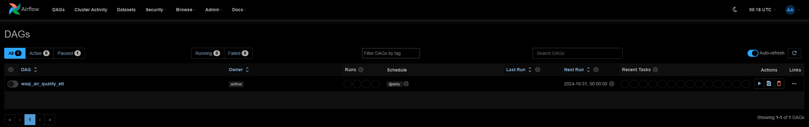
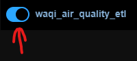
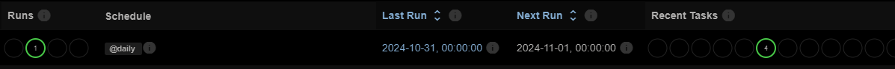

[](https://github.com/astral-sh/ruff)

# WAQI ETL 2024
**A Docker-based ETL pipeline that loads air quality data from the World’s Air Pollution API into ClickHouse**

## Table of Contents
- [Introduction](#introduction)
- [Platform](#platform)
  - [Orchestration](#orchestration)
  - [API](#api)
  - [Database](#database)
  - [Formatting and Linting](#formatting-and-linting)
- [Instructions](#instructions)
  - [Prerequisites](#prerequisites)
  - [How to run](#how-to-run)

# Introduction
This project is a sample ETL and database.
We use load data collected by stations from the World's Air Pollution API, and load relevant data points into a local database.

## Project Structure
```plaintext
.
├── airflow/                # Airflow-related files
│   ├── dags/               # DAG definitions
│   ├── docker-compose.yaml
│   ├── Dockerfile
│   └── .env-sample         # Sample .env file for Airflow
├── dwh/                    # Data warehouse (ClickHouse) setup
│   ├── docker-compose.yml
│   ├── setup_dwh.sh
│   ├── check_air_quality_data.sh
├── assets/                 # Images for the README
├── .github/                # GitHub Actions workflows
├── pyproject.toml          # Linting and formatting config
└── README.md               # Project documentation
```

# Platform
The ETL platform is built using docker, we create 2 containers; one for orchestration and one for the database.
The containers were separated as each performs a separate function and so should be easily replaced by a different service shouuld the need arise.

## Orchestration
Apache Airflow was chosen as the orchestration tool of choice. The initial docker compose file was taken from an example from the [Airflow documentation](https://airflow.apache.org/docs/apache-airflow/stable/howto/docker-compose/index.html). 
Some modifications were made to the initial file:

- Changed celery broker from Redis backend to RabbitMQ backend (due to less restrictive licensing)
- Moved the Airflow volumes into defined Docker volumes (previously filesystem volumes)
- Created .env file to contain sensitive information (see `./airflow/.env-sample` for an example of the required setup)

The advantage of using the example docker file over creating a single simple docker container for Airflow is the scalability the Celery broker and workers offer.

## API
The api is the [World's Air Pollution API](https://waqi.info/), which is a free to use API.
The docs for the API can be found [here](https://aqicn.org/json-api/doc/)

## Database
The database container runs a single clickhouse instance (this could be augmented to use a more scalable container with a scheduler and workers similar to the Airflow container - however that is beyond the current scope of this project)
See the following [Github repo](https://github.com/ClickHouse/examples/blob/main/docker-compose-recipes/README.md) for further examples of how to set up various Clickhouse configurations.

## Formatting and Linting
This project configures [Ruff](https://docs.astral.sh/ruff/) as a linter and formatter. The configuration is stored in `pyproject.toml`, which specifies which rules to apply when linting and formatting (see the [documentation](https://docs.astral.sh/ruff/rules/) for all available rules).

A Github action has been setup in `.github\workflows\workflow.yml` which runs the Ruff linter on pushes to the Github. It will fail with relevant errors when any of the linting rules are violated, ensuring that the code adheres to the defined style and quality standards.

Ruff can also be installed locally using `pip install ruff`.  
This allows the use of:
- `ruff check` to check for errors (add `--fix` argument to allow auto fixes for compatible rules)
- `ruff format` to auto format files based on the selected rules.

# Getting Started
## Prerequisites
Docker is required to run the docker containers. You can find installation instrutions on the [Docker website](https://docs.docker.com/desktop/).

The WAQI API requires an API token for authentication. A free token can be generated [here](https://aqicn.org/data-platform/token/).

While Python is not strictly required to run the project as it is running in Docker containers, it is recommended to have Python installed for Airflow and linting purposes.

## How to run
1. Use the sample .env files to create your own .env files. This can be done by renaming/copy and pasting the samples
1. Open a terminal in `./dwh`; Run `docker-compose up -d`, this will start the docker container for the database in detached mode (detached means the terminal does not keep focus of the Docker logs)
1. In the `./dwh` folder, run `./setup_dwh.ps1` or `./setup_dwh.sh` (in your respective preferred Powershell or Shell terminal). You can test database using `./dwh/check_air_quality_data.ps1` or `./dwh/check_air_quality_data.sh`.
1. Open a terminal (or change directory) in `./airflow`; Run `docker-compose up -d` to start the Airflow container
1. Open Airflow by going to `localhost:8080` in a web browser. Login using the Airflow user credentials in your Airflow .env file
The home page of Airflow once the container is running: 
1. The DAG toggle button next to the DAG title in Airflow:  
  
1. Once the DAG has completed, the dashboard should look like the following:

You can see what is in the database using `./dwh/check_air_quality_data.ps1` or `./dwh/check_air_quality_data.sh` again.
1. While the Docker containers are running, the DAG will run daily at 00h00 UTC, inserting new record into the table every run.